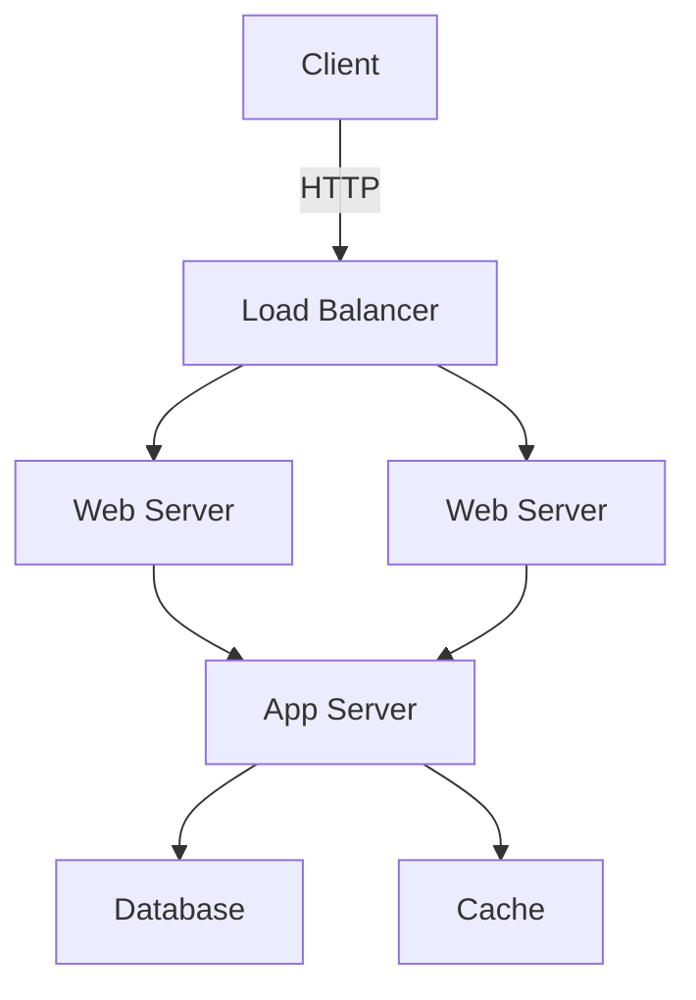
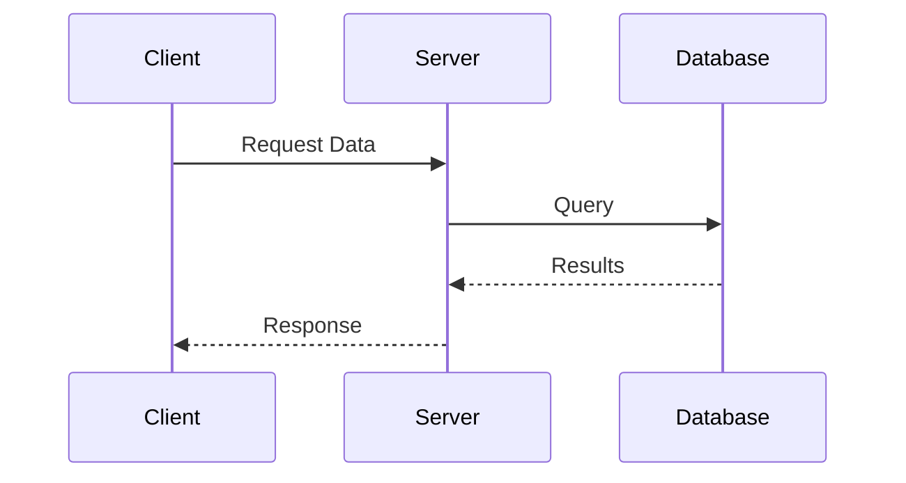

# Markdown to Google Docs/DOCX Converter with Mermaid Support

Convert Markdown documents containing Mermaid diagrams to either Google Docs or DOCX format, with diagrams rendered as embedded images.

## Features

- **Two output formats**: Google Docs (cloud) or DOCX (local file)
- Automatically renders Mermaid diagrams as images
- Supports markdown tables with proper formatting
- Professional code block formatting (grey background, black borders, Courier New font)
- Preserves markdown formatting (headers, bold, italic, lists)
- Supports both API-based and CLI-based Mermaid rendering
- Batch conversion of entire directories

## Prerequisites

1. **Python 3.7+** installed on your system
2. **For Google Docs output**: Google Cloud Project with Google Docs and Drive APIs enabled + OAuth 2.0 credentials
3. **For DOCX output**: No additional setup required (works offline)

## Setup Instructions

### 1. Install Python Dependencies

```bash
pip install -r requirements.txt
```

### 2. Set up Google API Credentials

1. Go to the [Google Cloud Console](https://console.cloud.google.com/)
2. Create a new project or select an existing one
3. Enable the following APIs:
   - Google Docs API
   - Google Drive API
4. Go to "Credentials" → "Create Credentials" → "OAuth client ID"
5. Choose "Desktop app" as the application type
6. Download the credentials JSON file and save it as `credentials.json` in the same directory as the script

### 3. Optional: Install Mermaid CLI (for local rendering)

If you prefer to render Mermaid diagrams locally instead of using the online API:

```bash
# Install Node.js first, then:
npm install -g @mermaid-js/mermaid-cli
```

## Usage

### DOCX Conversion (Recommended for Transfer)

Convert to DOCX format - creates local Word document that can be uploaded to Google Docs:

```bash
# Single file
python md2docx.py example.md

# Entire directory
python md2docx.py /path/to/markdown/files/

# Custom output location
python md2docx.py example.md --output /custom/path/output.docx
```

Output files are saved to `docx/` subdirectory by default.

**Workflow for transferring to Google Docs:**
1. Run `python md2docx.py your_file.md` on home computer
2. Transfer the DOCX file (USB/email/cloud) to work computer
3. In Google Docs: File → Open → Upload the DOCX file

### Google Docs Conversion (Direct Upload)

Convert directly to Google Docs (requires Google API setup):

```bash
# Single file
python md2gdocs.py example.md

# With custom title
python md2gdocs.py example.md --title "My Custom Document Title"

# Entire directory
python md2gdocs.py /path/to/markdown/files/

# With custom credentials file
python md2gdocs.py example.md --credentials /path/to/credentials.json

# Using local Mermaid CLI instead of API
python md2gdocs.py example.md --use-cli
```

## Example Markdown File

Create a file `example.md`:

```markdown
# Project Architecture

This document describes our system architecture.

## Overview

Our system uses a microservices architecture with the following components:



## Data Flow

The data flows through our system as follows:



## Code Example

Here's a sample Python function:

```python
def process_data(data):
    return [x * 2 for x in data]
```
```

Here's a sample table:

| Field | Type | Required | Example | Description |
|-------|------|----------|---------|-------------|
| name | string | Yes | `"John"` | User's name |
| age | integer | No | `25` | User's age |
```

Then convert it:

```bash
# To DOCX
python md2docx.py example.md

# To Google Docs
python md2gdocs.py example.md --title "System Architecture Document"
```

## How It Works

### md2docx.py (DOCX Converter)

1. **Parse Markdown**: Identifies regular content, code blocks, tables, and Mermaid diagrams
2. **Render Mermaid Diagrams**: Converts diagrams to PNG images via mermaid.ink API
3. **Create DOCX**: Uses python-docx to create a Word document with:
   - Formatted headers, bold, italic, lists
   - Professional code blocks (grey background, black borders, Courier New font)
   - Properly formatted tables with header styling
   - Embedded diagram images
4. **Output**: Saves to `docx/` subdirectory

### md2gdocs.py (Google Docs Converter)

1. **Parse Markdown**: Same as above
2. **Render Mermaid Diagrams**: Same as above
3. **Upload Images**: Uploads rendered diagrams to Google Drive
4. **Create Google Doc**: Uses Google Docs API to create document with formatted content
5. **Output**: Returns URL to the newly created Google Doc

## First-Time Authentication (Google Docs only)

On first run of `md2gdocs.py`, the script will:
1. Open your default web browser
2. Ask you to sign in to your Google account
3. Request permissions to:
   - Create and modify Google Docs
   - Upload files to Google Drive
4. Save authentication tokens locally in `token.json` for future use

## Troubleshooting

### "Credentials file not found"
- Make sure you've downloaded the OAuth 2.0 credentials from Google Cloud Console
- Save the file as `credentials.json` in the script directory

### "API not enabled"
- Go to Google Cloud Console
- Enable both Google Docs API and Google Drive API

### Mermaid diagrams not rendering
- Check your internet connection (for API rendering)
- For local rendering, ensure `mmdc` command is available in your PATH

### Permission denied errors
- Ensure your Google account has permission to create documents and upload files
- Try deleting `token.json` and re-authenticating

## Supported Markdown Features

✅ **Supported:**
- Headers (H1-H6)
- Bold, italic, inline code
- Bulleted and numbered lists
- Code blocks with language specification
- Mermaid diagrams (all types)
- Tables with header formatting
- Nested lists

❌ **Not Supported:**
- Footnotes
- Task lists
- HTML blocks
- Some extended markdown syntax

## Limitations

- Complex Mermaid diagrams might timeout when using the API
- Image sizing is set to default values (6 inches width for DOCX, 400x300pt for Google Docs)
- Google Docs table formatting may differ slightly from DOCX

## Files and Output

- **Input**: `.md` markdown files
- **Output (DOCX)**: `docx/` subdirectory (created automatically)
- **Output (Google Docs)**: Creates docs in your Google Drive
- **Ignored files**: See `.gitignore` for excluded files (credentials, output dirs, Python cache)

## Security Notes

- `credentials.json`: Keep this file secure and don't commit it to version control (Google Docs only)
- `token.json`: Created after first authentication, also keep secure (Google Docs only)
- DOCX files are created locally and contain no sensitive information
- Mermaid.ink API is used for diagram rendering (diagrams are sent externally)

## License

MIT License - Feel free to modify and use as needed.