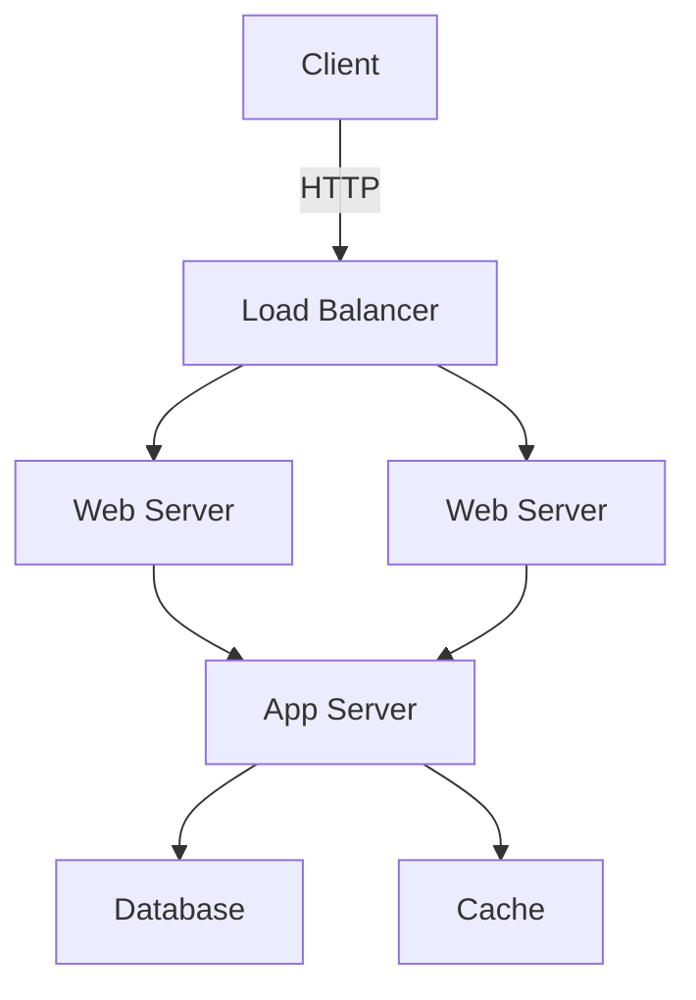
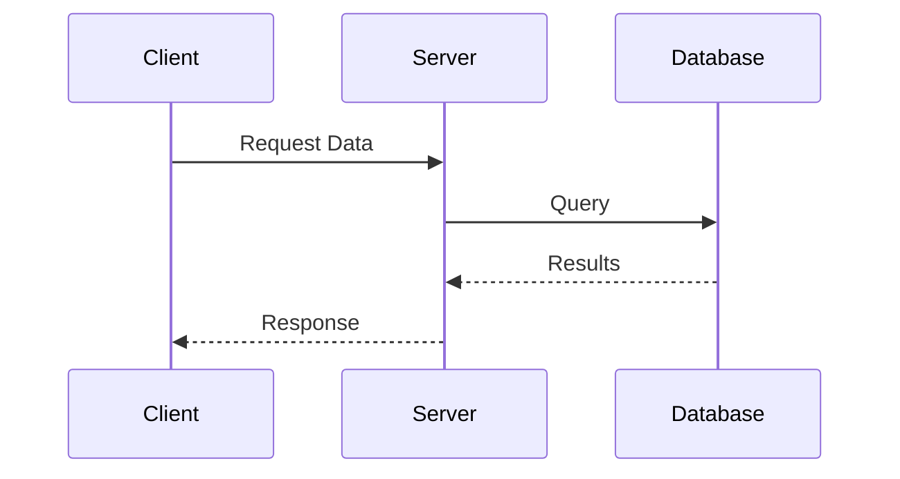

# Markdown to Google Docs Converter with Mermaid Support

This Python script converts Markdown documents containing Mermaid diagrams into Google Docs, with the diagrams rendered as embedded images.

## Features

- Converts Markdown content to Google Docs format
- Automatically renders Mermaid diagrams as images
- Uploads images to Google Drive and embeds them in the document
- Preserves code blocks and basic markdown formatting
- Supports both API-based and CLI-based Mermaid rendering

## Prerequisites

1. **Python 3.7+** installed on your system
2. **Google Cloud Project** with Google Docs and Drive APIs enabled
3. **OAuth 2.0 credentials** for desktop application

## Setup Instructions

### 1. Install Python Dependencies

```bash
pip install -r requirements.txt
```

### 2. Set up Google API Credentials

1. Go to the [Google Cloud Console](https://console.cloud.google.com/)
2. Create a new project or select an existing one
3. Enable the following APIs:
   - Google Docs API
   - Google Drive API
4. Go to "Credentials" → "Create Credentials" → "OAuth client ID"
5. Choose "Desktop app" as the application type
6. Download the credentials JSON file and save it as `credentials.json` in the same directory as the script

### 3. Optional: Install Mermaid CLI (for local rendering)

If you prefer to render Mermaid diagrams locally instead of using the online API:

```bash
# Install Node.js first, then:
npm install -g @mermaid-js/mermaid-cli
```

## Usage

### Basic Usage

```bash
python markdown_to_gdocs.py your_document.md
```

### With Custom Title

```bash
python markdown_to_gdocs.py your_document.md --title "My Custom Document Title"
```

### Using Local Mermaid CLI

```bash
python markdown_to_gdocs.py your_document.md --use-cli
```

### With Custom Credentials File

```bash
python markdown_to_gdocs.py your_document.md --credentials /path/to/credentials.json
```

## Example Markdown File

Create a file `example.md`:

```markdown
# Project Architecture

This document describes our system architecture.

## Overview

Our system uses a microservices architecture with the following components:



## Data Flow

The data flows through our system as follows:



## Code Example

Here's a sample Python function:

```python
def process_data(data):
    return [x * 2 for x in data]
```
```

Then convert it:

```bash
python markdown_to_gdocs.py example.md --title "System Architecture Document"
```

## How It Works

1. **Parse Markdown**: The script parses your markdown file and identifies:
   - Regular markdown content (headers, text, lists, etc.)
   - Code blocks with syntax highlighting
   - Mermaid diagram blocks

2. **Render Mermaid Diagrams**: Each Mermaid diagram is rendered to a PNG image using either:
   - The mermaid.ink API (default, no installation required)
   - Local Mermaid CLI (if `--use-cli` flag is used)

3. **Create Google Doc**: The script:
   - Creates a new Google Doc with your specified title
   - Uploads rendered diagram images to Google Drive
   - Inserts content with proper formatting
   - Embeds diagram images in the appropriate positions

4. **Output**: Returns a URL to the newly created Google Doc

## First-Time Authentication

On first run, the script will:
1. Open your default web browser
2. Ask you to sign in to your Google account
3. Request permissions to:
   - Create and modify Google Docs
   - Upload files to Google Drive
4. Save authentication tokens locally in `token.json` for future use

## Troubleshooting

### "Credentials file not found"
- Make sure you've downloaded the OAuth 2.0 credentials from Google Cloud Console
- Save the file as `credentials.json` in the script directory

### "API not enabled"
- Go to Google Cloud Console
- Enable both Google Docs API and Google Drive API

### Mermaid diagrams not rendering
- Check your internet connection (for API rendering)
- For local rendering, ensure `mmdc` command is available in your PATH

### Permission denied errors
- Ensure your Google account has permission to create documents and upload files
- Try deleting `token.json` and re-authenticating

## Limitations

- The script converts basic markdown formatting but may not support all markdown extensions
- Complex Mermaid diagrams might timeout when using the API
- Image sizing in Google Docs is set to default values (can be modified in the code)

## Security Notes

- `credentials.json`: Keep this file secure and don't commit it to version control
- `token.json`: Created after first authentication, also keep secure
- The script makes uploaded images publicly viewable (can be changed in the code)

## License

MIT License - Feel free to modify and use as needed.