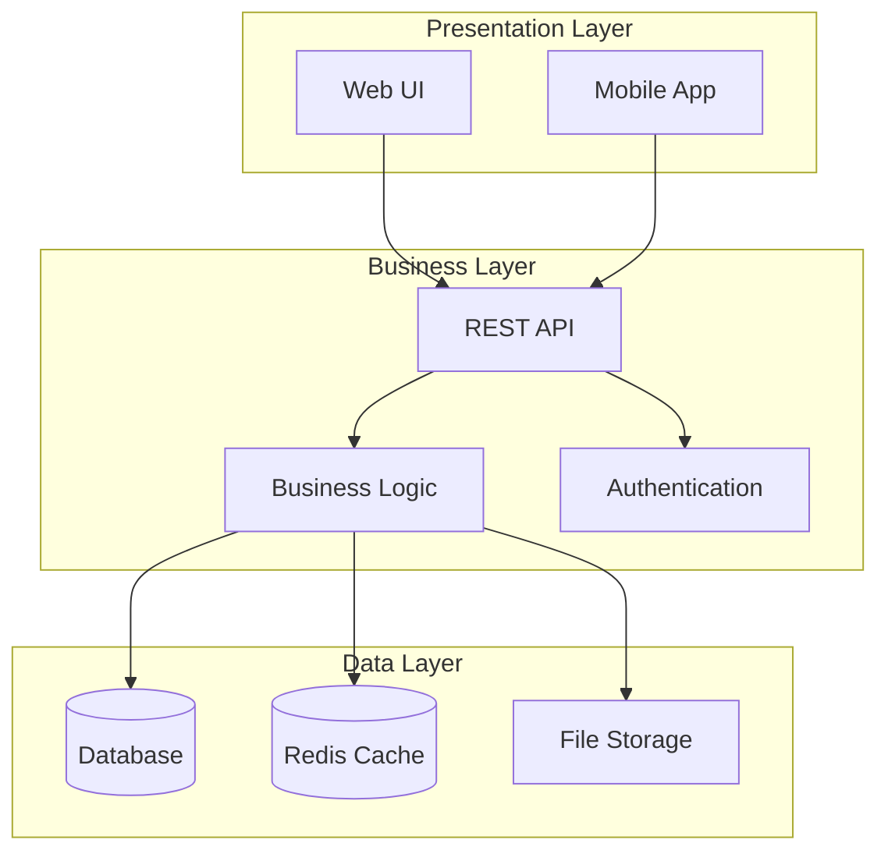
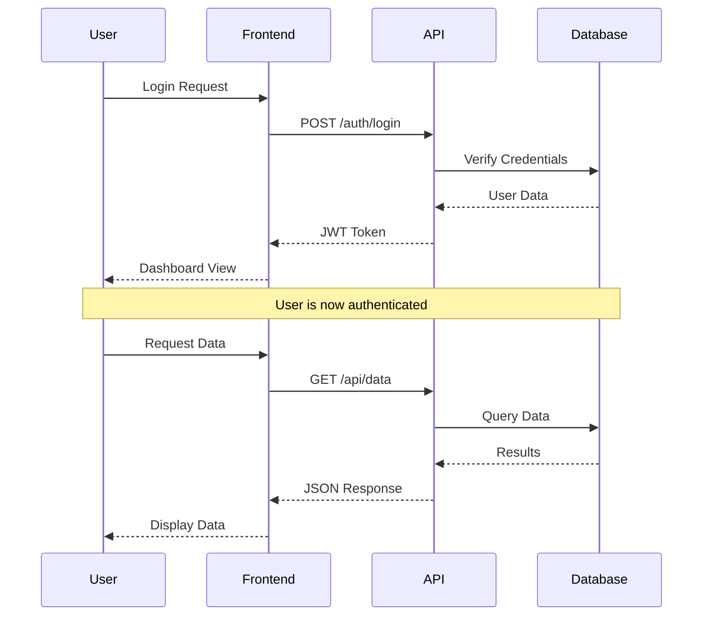
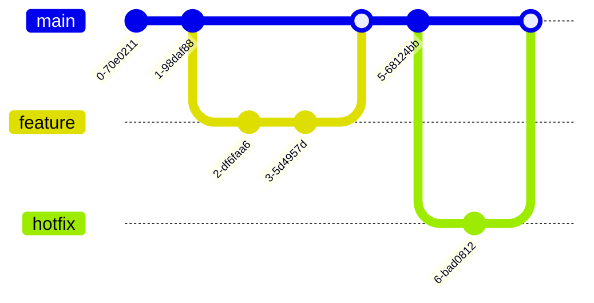
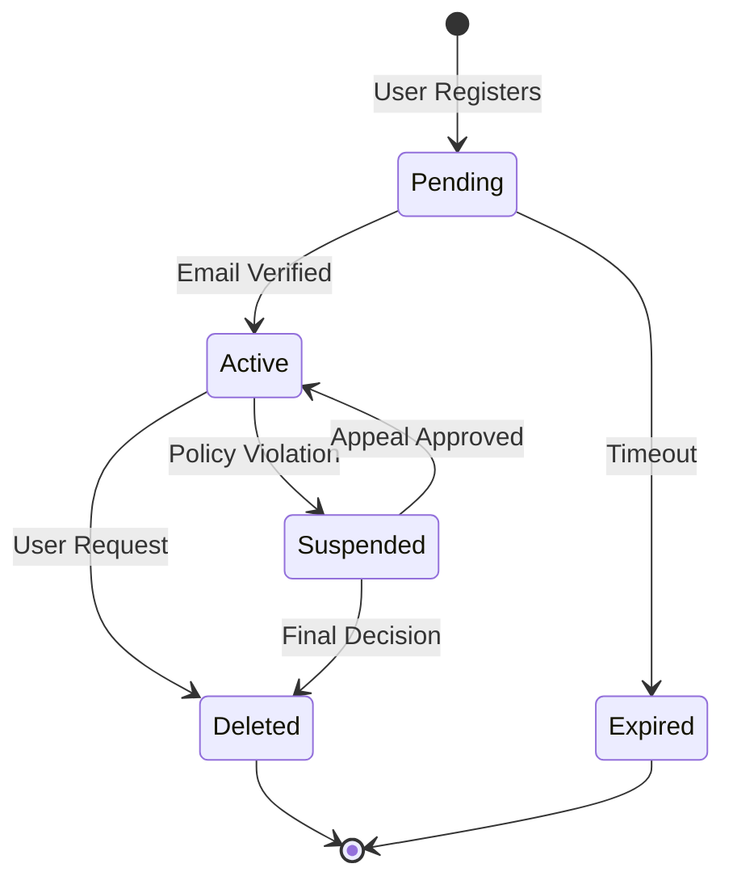
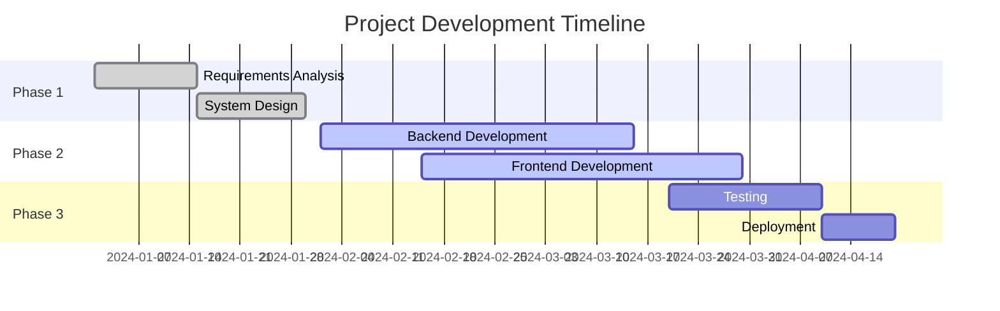
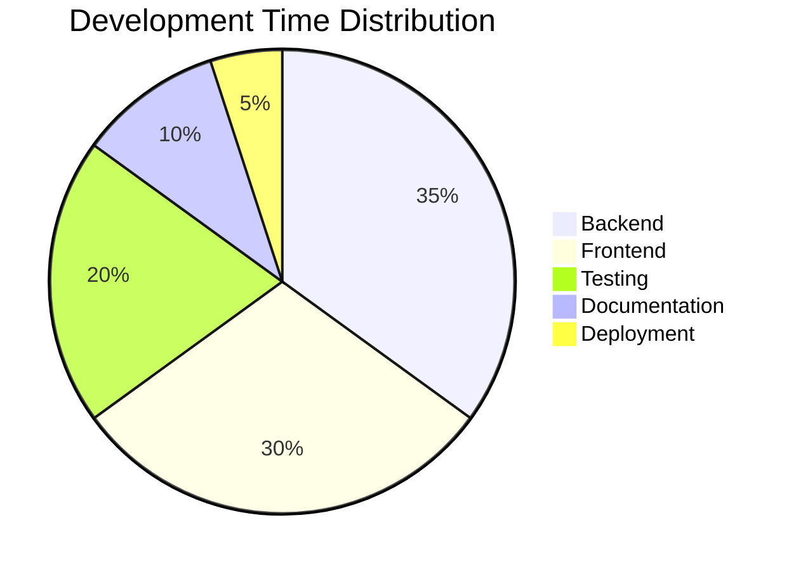

# Sample Document with Mermaid Diagrams

## Introduction

This is a sample markdown document that demonstrates the conversion of Mermaid diagrams to Google Docs.

## System Architecture

Our application follows a typical three-tier architecture:



## User Flow

Here's how a typical user interaction works:



## Development Process

Our development workflow:



## State Machine Example

User account states:



## Code Examples

### Python Example

```python
def fibonacci(n):
    """Generate Fibonacci sequence up to n terms."""
    if n <= 0:
        return []
    elif n == 1:
        return [0]
    elif n == 2:
        return [0, 1]
    
    fib_sequence = [0, 1]
    for i in range(2, n):
        fib_sequence.append(fib_sequence[-1] + fib_sequence[-2])
    
    return fib_sequence

# Example usage
print(fibonacci(10))
```

### JavaScript Example

```javascript
// Async function to fetch user data
async function fetchUserData(userId) {
    try {
        const response = await fetch(`/api/users/${userId}`);
        if (!response.ok) {
            throw new Error(`HTTP error! status: ${response.status}`);
        }
        const data = await response.json();
        return data;
    } catch (error) {
        console.error('Error fetching user data:', error);
        return null;
    }
}
```

## Project Timeline



## Pie Chart Example

Distribution of development time:



## Table

**Structured Log Format Requirements:**

| Field | Type | Required | Example | Description |
|-------|------|----------|---------|-------------|
| level | string | Yes | `INFO` | Log level (DEBUG, INFO, WARNING, ERROR, CRITICAL) |
| event | string | Yes | `task_assigned` | Event type identifier |
| task_id | string | No | `task_001` | Task identifier (when applicable) |
| priority | integer | No | `85` | Task priority (for task events) |
| assignment_score | float | No | `0.92` | Assignment score (for assignment events) |
| message | string | Yes | `test` | Human-readable message |

## Conclusion

This document demonstrates various types of Mermaid diagrams that can be converted to Google Docs format with embedded images.

### Features Demonstrated

- Flowcharts and graphs
- Sequence diagrams
- Git graphs
- State diagrams
- Gantt charts
- Pie charts
- Code blocks with syntax highlighting
- Regular markdown formatting

All these elements will be properly converted to Google Docs format.

